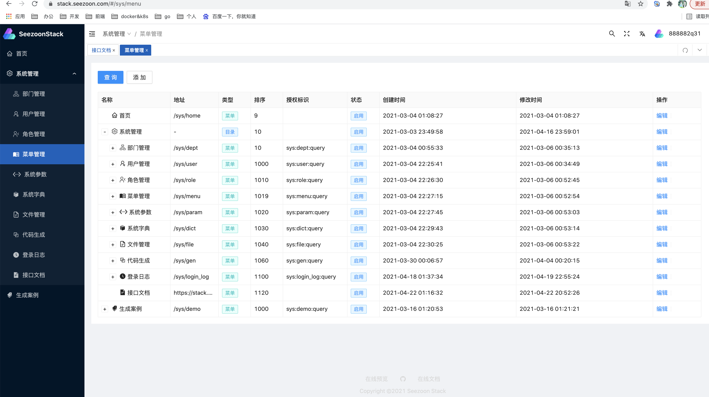
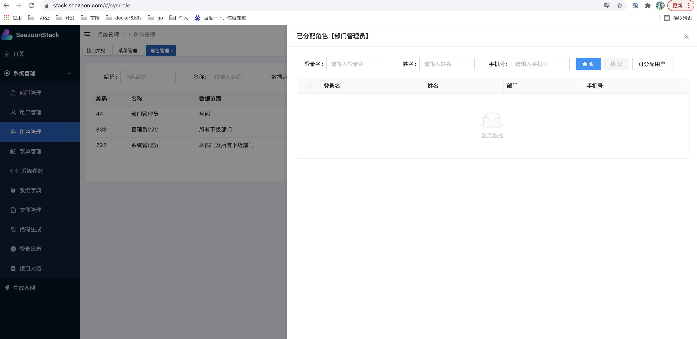
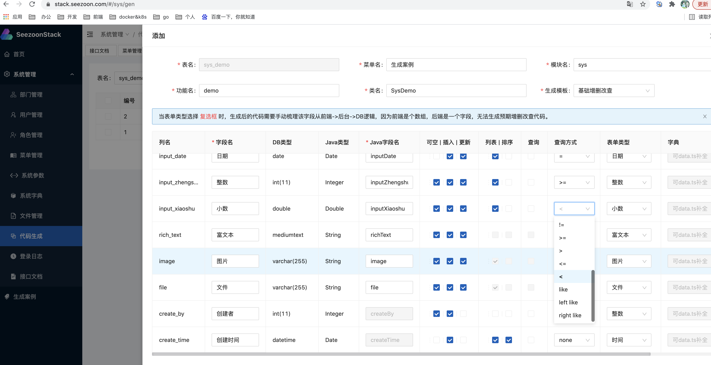
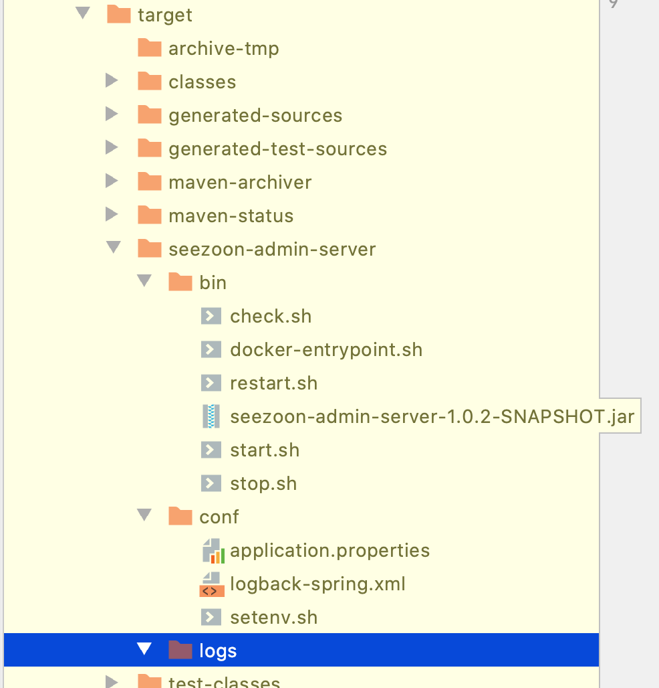

## 简介

**Seezoon Stack** 以**快速开发**为目的，在开发速度和代码结构上做出一定取舍，无论如何，你将看到**非常地道**的 Java
常用开发框架使用。该项目采用主流开发框架，无论打包、编译、部署都按着大公司的标准完成并不断逐步完善。

## 💻 在线演示

**详细文档及演示地址：**  [https://doc.stack.seezoon.com](https://doc.stack.seezoon.com)

账号：admin

密码：123456


部分效果图：







## 技术选型

**Seezoon Stack** 采用当下最前沿前后端的技术栈完成。

后台**主要**框架：

| 框架名称                  | 框架地址                                             | 说明           |
| ------------------------- | ---------------------------------------------------- | -------------- |
| Spring Boot               | https://spring.io/projects/spring-boot               | 自动装配       |
| Spring Session Data Redis | https://spring.io/projects/spring-session-data-redis | 登录态管理     |
| Spring Security           | https://spring.io/projects/spring-security           | 登录及权限控制 |
| Mybatis                   | https://mybatis.org/mybatis-3/zh/index.html          | 持久层         |
| Springfox                 | https://github.com/springfox/springfox               | openAPI 3 文档 |

## 特性

- JSR303 验证、标准API模型，错误码、异常处理封装
- 请求埋点，返回头添加`X-Trace-Id`，通过`MDC`在日志中埋入线程ID;
- Redis 封装，序列化
- RestTemplate 线程池、证书请求及默认属性约定
- Spring Boot 异步线程配置
- 跨域支持
- 基于openAPI 3.0 规范的自动生成文档
- 前后端一体化代码生成
- 登录及权限控制
- 文件处理，支持磁盘文件和阿里云OSS
- 国际化
- 通用数据权限
- 动态菜单&按钮

优先级较低的功能(TODO)：

- 阿里云短信
- Excel 处理
- 微信公众号、小程序相关，登录，支付等常用封装
- 云原生部署及编排文档

前台**主要**框架：

| 框架名称         | 框架地址                                        | 说明            |
| ---------------- | ----------------------------------------------- | --------------- |
| Vue 3            | https://v3.cn.vuejs.org/guide/introduction.html | 双向绑定        |
| Vite             | https://cn.vitejs.dev/                          | 构建工具        |
| Ant Design Vue 2 | https://2x.antdv.com/components/overview-cn/    | 组件            |
| TypeScript 4     | https://www.typescriptlang.org/zh/              | JavaScript 超集 |
| Windi Css        | https://windicss.org/guide/                     | css 辅助类      |
| Iconify          | https://iconify.design/                         | 图标库          |

前端框架 fork  [Vue vben admin 2.0](https://vvbin.cn/doc-next/)，定期会合并上游特性，具体组件请参考 Vben admin 文档。在此也感谢Vben admin 对该项目提供的帮助。

前端主要采用Ant Design Vue 2 作为主要组件库，降低学习成本，主体框架均为TypeScript，业务功能采用JavaScript编写，针对快速开发JavaScript 代码量较为简洁，速度较快。

## 环境准备

- JDK 1.8 + （建议11）
- Maven 3 +
- Node 12 +
- Yarn（安装完node，可用`npm install -g yarn`）
- Redis
- Mysql 5.7 + (建议8)

## 🚀 快速开始

**代码下载**

可以通过 IDEA `File->New->Project From Version Control `导入，也可以通过命令下载后导入。

> 建议fork 后到自己仓库后再导入，方便后续同步更新。

```
git clone https://github.com/734839030/seezoon-stack.git
```

**工程结构**

```
​```
.
└── seezoon-stack   parent工程
    ├── build 构建所需文件
    │   ├── assembly    生成产出物结构
    │   │   ├── bin     项目脚本
    │   │   ├── conf    配置目录
    │   │   ├── logs    日志目录
    │   │   └── assembly.xml     maven assembly 打包插件描述文件(不打包到产出物)
    │   ├── build.sh    构建脚本
    │   ├── eclipse-codestyle.xml  P3C代码格式,可以自行更新
    │   ├── maven-settings.xml     maven的setting配置(可选)
    │   └── mybatis-generator-config.xml  原生mybatis-generator 描述文件(可选)
    ├── db DB脚本目录
    ├── doc 项目文档及资料维护目录
    ├── seezoon-admin-server  管理端服务
    ├── seezoon-admin-web  后台页面目前fork上游,代码库单独维护稳定后合并
    ├── seezoon-dao    DAO层，方便管理端和C端引用
    ├── seezoon-framework  管理端和C端通用框架层(基础中间件,参数验证，安全控制)
    ├── seezoon-generator  通用代码生成器，可以单独使用也可以供其他组件继承使用
    └── seezoon-user-server  C端服务端TODO
​```
```

### 后台

- **初始化DB脚本**

  脚本见`db/seezoon-stack.sql`

- **配置seezoon-admin-server**

  在如下配置文件配置**DB**和**Redis**账号密码

  `seezoon-admin-server/src/main/resources/application-local.properties`

- **IDEA中启动后台**

> 执行如下类中Main方法(如果报依赖错误，可以执行parent 工程mvn package)

​      `seezoon-admin-server/src/main/java/com/seezoon/admin/AdminMain.java`

### 前台

- **安装依赖并启动**

  ```
  cd seezoon-stack/seezoon-admin-web
  yarn install
  yarn serve 
  
  # 访问地址
  http://localhost:3100/
  ```

- **本地测试文件服务器(可选)**

  ```
  cd seezoon-admin-web/test/server/upload
  yarn install
  yarn start
  
  # 管理端上传文件后，可以直接访问地址static目录静态文件
  http://localhost:3001/static/xxxx
  ```

## 生产环境部署

线上目录结构，

```
/data/
│── cert
├── seezoon-admin-server  # 后台产出物
│   ├── bin
│   ├── conf
│   ├── logs
│   └── work
├── seezoon-admin-web    # 前端产出物
│   ├── assets
│   └── resource
└── upload-server  文件上传目录，默认使用磁盘文件，使用OSS则不需要.
```

### 😇 手工部署-后台

> 线上环境安装Java 1.8 + ，推荐11。

采用[maven-assembly-plugin](http://maven.apache.org/plugins/maven-assembly-plugin/)生成构建物，可以直接生成生产部署的目录结构，方便DevOps 集成.

```
cd seezoon-admin-server
mvn clean package
```

**产出物目录**

`seezoon-admin-server/target/seezoon-admin-server`

**只需要维护产出物`conf `目录的`application.properties `即可**，然后就可以发布了。

> 配置文件与环境分离，`maven-jar-plugin` 打包产出物`jar`会排出`resources`目录如下文件：

```
application-local.properties
logback-spring.xml
```

> 如果不介意各个环境配置都在工程中那就很方便，使用spring boot 提供的`--spring.profiles.active`，在启动命令中选择配置文件。



### 😇 手工部署-前台

```
cd seezoon-admin-web
yarn build
```

**产出物**

`seezoon-admin-web/dist` 中文件发布到线上nginx 目录即可，该工程nginx 配置如下，仅供参考。

```
upstream seezoon-admin-server {
    server 127.0.0.1:8080 max_fails=3 fail_timeout=10s;
}

server {
    listen       80;
    server_name  stack.seezoon.com;
    rewrite ^(.*)$  https://$host$1 permanent;
}

server {
    listen       443;
    server_name  stack.seezoon.com;
    ssl on;
    ssl_certificate   /data/cert/stack.seezoon.com.pem; 
    ssl_certificate_key  /data/cert/stack.seezoon.com.key;
    ssl_session_timeout 5m;
    ssl_ciphers ECDHE-RSA-AES128-GCM-SHA256:ECDHE:ECDH:AES:HIGH:!NULL:!aNULL:!MD5:!ADH:!RC4;
    ssl_protocols TLSv1 TLSv1.1 TLSv1.2;
    ssl_prefer_server_ciphers on;

    # api
    location ^~ /api/ {
        proxy_redirect off;
        proxy_set_header Host $host;
        proxy_set_header X-Real-IP $remote_addr;
        proxy_set_header X-Real-PORT $remote_port;
        proxy_set_header X-Forwarded-For $proxy_add_x_forwarded_for;
        proxy_pass http://seezoon-admin-server/;
    }
    # 文件服务
    location ^~ /file/ {
        access_log off;
        alias /data/upload-server/;
    }

    # 静态资源
    location / {
        access_log off;
        root /data/seezoon-admin-web/;
        index index.html index.htm;
    }

}
```

> 可选静态资源压缩配置，放在`nginx.conf http` 节点下。

```
# 打开gzip 效果更佳
gzip on;
gzip_min_length 1k;
gzip_buffers 4 16k;
gzip_http_version 1.0;
gzip_comp_level 6;
gzip_types text/plain application/javascript application/x-javascript text/css application/xml text/javascript application/x-httpd-php image/jpeg image/gif image/png;
gzip_vary off;
gzip_disable "MSIE [1-6]\.";
```


## 如何贡献

非常欢迎你的加入！[提一个 Issue](https://github.com/734839030/seezoon-stack/issues/new) 或者提交一个 Pull Request。

**Pull Request：**

1. Fork 代码! (同步上游：git pull https://github.com/734839030/seezoon-stack.git master)
2. 创建自己的分支: `git checkout -b feat/xxxx`
3. 提交你的修改: `git commit -m 'feat(function): add xxxxx'`
4. 推送您的分支: `git push origin feat/xxxx`
5. 提交`pull request`

## Git 贡献提交规范

参考规范 ([Angular](https://github.com/conventional-changelog/conventional-changelog/tree/master/packages/conventional-changelog-angular))

    - `feat` 增加新功能
    - `fix` 修复问题/BUG
    - `style` 代码风格相关无影响运行结果的
    - `perf` 优化/性能提升
    - `refactor` 重构
    - `revert` 撤销修改
    - `test` 测试相关
    - `docs` 文档/注释
    - `chore` 依赖更新/脚手架配置修改等
    - `workflow` 工作流改进
    - `ci` 持续集成
    - `types` 类型定义文件更改
    - `wip` 开发中

