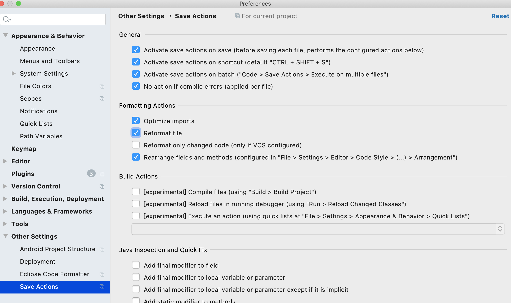
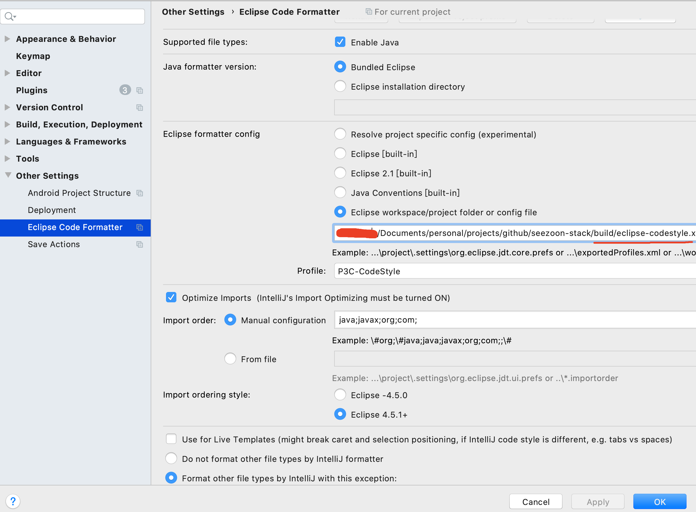
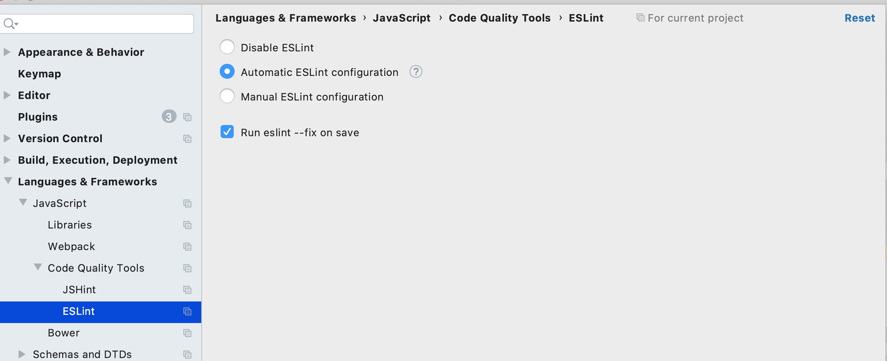

**Seezoon Stack**
 [](https://github.com/734839030/seezoon-stack/stargazers)
 [](https://github.com/734839030/seezoon-stack/fork)

###  简介

**Seezoon Stack** 以**快速开发**为目的，在开发速度和代码结构上做出一定取啥，无论如何，你将看到**最地道**的 Java 常用开发框架使用。该项目采用主流开发框架，无论打包、编译、部署都按着大公司的标准完成并不断逐步完善。

### 在线演示

[http://stack.seezoon.com/](http://stack.seezoon.com/)

账号：admin

密码：123456

部分效果图：


### 技术选型

**Seezoon Stack** 采用当下最前言前后端的技术栈完成。

后台**主要**框架：

| 框架名称                  | 框架地址                                             | 说明           |
| ------------------------- | ---------------------------------------------------- | -------------- |
| Spring Boot               | https://spring.io/projects/spring-boot               | 自动装配       |
| Spring Session Data Redis | https://spring.io/projects/spring-session-data-redis | 登录态管理     |
| Spring Security           | https://spring.io/projects/spring-security           | 登录及权限控制 |
| Mybatis                   | https://mybatis.org/mybatis-3/zh/index.html          | 持久层         |
| Springfox                 | https://github.com/springfox/springfox               | openAPI 3 文档 |

#### 特性

- JSR303 验证、标准API模型，错误码、异常处理封装
- 请求埋点，返回头添加`X-Trace-Id`，通过`MDC`在日志中埋入线程ID;
- Redis 封装，序列化
- RestTemplate 线程池及默认属性约定
- Spring Boot 异步线程配置
- 跨域配置
- 基于openAPI 3.0 规范的自动生成文档
- 前后端代码生成
- 登录及权限控制
- 文件处理，支持磁盘文件和阿里与OSS

优先级较低的功能(TODO)：

- 阿里云短信
- Excel 处理
- 微信公众号、小程序相关，登录，支付等常用封装
- 通用数据权限
- 云原生部署及编排文档

前台**主要**框架：

| 框架名称         | 框架地址                                        | 说明            |
| ---------------- | ----------------------------------------------- | --------------- |
| Vue 3            | https://v3.cn.vuejs.org/guide/introduction.html | 双向绑定        |
| Vite             | https://cn.vitejs.dev/                          | 构建工具        |
| Ant Design Vue 2 | https://2x.antdv.com/components/overview-cn/    | 组件            |
| TypeScript 4     | https://www.typescriptlang.org/zh/              | JavaScript 超集 |
| Windi Css        | https://windicss.org/guide/                     | css 辅助类      |
| Iconify          | https://iconify.design/                         | 图标库          |

前端框架 fork  [Vue vben admin 2.0](https://vvbin.cn/doc-next/)，定期会合并上游特性，具体组件请参考 Vben admin 文档。在此也感谢Vben admin 对该项目提供的帮助。

前端主要采用Ant Design Vue 2 作为主要组件库，降低学习成本，主体框架均为TypeScript，业务功能采用JavaScript编写，针对快速开发JavaScript 代码量较为简洁，速度较快。


### 环境准备

- JDK 1.8 + （建议11）
- Maven 3 + 
- Node 12 +
- Yarn（安装完node，可用`npm install -g yarn`）
- Redis 
- Mysql 5.7 + (建议8)

### IDEA 配置

**建议都配置**，可以实现Java 和前端代码自动格式化，统一编码标准。

安装在IDEA 中分别安装插件

【**必须**】**Lombok** 简化代码神器，安装即可 

【可选】**Save Actions** 保存代码自动格式化，配置如下图




【可选】**Eclipse Code Formatter** 使用阿里[P3C](https://github.com/alibaba/p3c) 格式化规范，已放置在`build/eclipse-codestyle.xml`，配置如下图




【可选】**EsLint **(IDEA 内置)前端格式化，配置如下图




### 快速开始

- 代码下载

  可以通过 IDEA `File->New->Project From Version Control `导入，也可以通过命令下载后导入。

  >  建议fork 后到自己仓库后再导入，方便后续同步更新。

  ```
  git clone https://github.com/734839030/seezoon-stack.git
  ```

- 工程结构

```
​```
.
└── seezoon-stack   parent工程
    ├── build 构建所需文件
    │   ├── assembly    生成产出物结构
    │   │   ├── bin     项目脚本
    │   │   ├── conf    配置目录
    │   │   ├── logs    日志目录
    │   │   └── assembly.xml     maven assembly 打包插件描述文件(不打包到产出物)
    │   ├── build.sh    构建脚本
    │   ├── eclipse-codestyle.xml  P3C代码格式,可以自行更新
    │   ├── maven-settings.xml     maven的setting配置(可选)
    │   └── mybatis-generator-config.xml  原生mybatis-generator 描述文件(可选)
    ├── db DB脚本目录
    ├── doc 项目文档及资料维护目录
    ├── seezoon-admin-server  管理端服务
    ├── seezoon-admin-web  后台页面目前fork上游,代码库单独维护稳定后合并
    ├── seezoon-dao    DAO层，方便管理端和C端引用
    ├── seezoon-framework  管理端和C端通用框架层(基础中间件,参数验证，安全控制)
    ├── seezoon-generator  通用代码生成器，可以单独使用也可以供其他组件继承使用
    └── seezoon-user-server  C端服务端TODO
​```
```

#### 后台

- 初始化DB脚本

  脚本见`db/seezoon-stack.sql`

- 配置seezoon-admin-server

  在如下配置文件配置**DB**和**Redis**账号密码

  `seezoon-admin-server/src/main/resources/application-local.properties`

​       启动后台，执行如下类中Main方法(如果报依赖错误，可以执行parent 工程mvn package)

​	  `seezoon-admin-server/src/main/java/com/seezoon/admin/AdminMain.java`

#### 前台

- 安装依赖并启动

  ```
  cd seezoon-stack/seezoon-admin-web
  yarn install
  yarn serve 
  
  # 访问地址
  http://localhost:3100/
  ```

- 本地测试文件服务器(可选)

  ```
  cd seezoon-admin-web/test/server/upload
  yarn install
  yarn start
  
  # 管理端上传文件后，可以直接访问地址static目录静态文件
  http://localhost:3001/static/xxxx
  ```

### 功能介绍

持续完善中......

### 常用开发指南

持续完善中......


